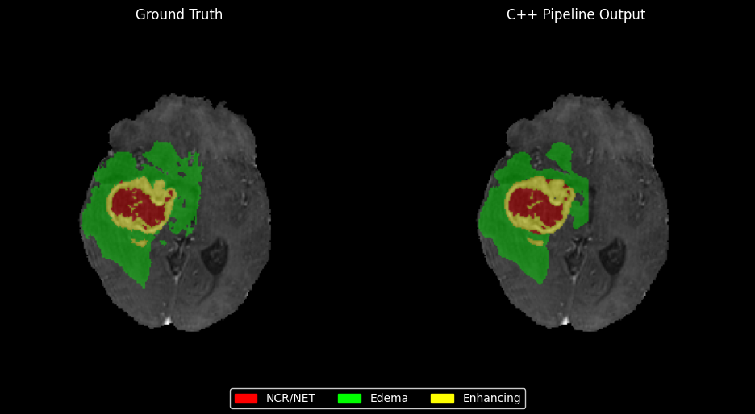

# neuro-lesion-cpp

C++ inference pipeline for 3D brain lesion segmentation (BraTS 2020). 
Runs ONNX models on multi-modal MRI without Python at runtime.



## Quick start

You need a C++17 compiler, CMake 3.18+, and zlib. ONNX Runtime is pulled 
automatically during the build.

    mkdir build && cd build
    cmake .. -DCMAKE_BUILD_TYPE=Release
    cmake --build . --parallel

The model is not included. I trained a 3D U-Net on BraTS 2020 in a Colab 
notebook and exported it to ONNX (opset 17). Input shape is 
[batch, 4, 128, 128, 128] (FLAIR/T1/T1ce/T2), output is 
[batch, 4, 128, 128, 128] (background + 3 tumor subregions).

## Running

Point it at a directory containing the four BraTS modality files 
(identified by `_flair`, `_t1`, `_t1ce`, `_t2` in the filename):

    ./brain_lesion_seg \
        --input-dir /data/BraTS20_Training_001 \
        --output /results/seg_001.nii \
        --model /path/to/brats_unet3d.onnx

Other flags: `--device cpu|cuda`, `--patch-overlap 0.5`, 
`--min-component-size 100`.

## How it works

1. Load the 4 NIfTI volumes, convert to float
2. Z-score normalize each modality (nonzero voxels only)
3. Extract overlapping 128^3 patches
4. Run each patch through ONNX Runtime
5. Average overlapping logits, softmax, argmax
6. Remove small connected components (BFS flood fill)
7. Write the label mask as NIfTI, preserving the original affine

Output labels: 0 = background, 1 = NCR/NET, 2 = edema, 3 = enhancing.

## Validation

Tested on 5 BraTS 2020 training cases to check C++ vs Python agreement. 
The model itself gets ~0.73 mean Dice on the full validation split 
(nothing crazy, it's a small U-Net).

| Subject | NCR/NET | Edema | Enhancing | Time (s) |
|---------|---------|-------|-----------|----------|
| 001     | 0.856   | 0.881 | 0.889     | 439      |
| 002     | 0.891   | 0.825 | 0.855     | 440      |
| 003     | 0.629   | 0.740 | 0.851     | 434      |
| 004     | 0.726   | 0.943 | 0.889     | 441      |
| 005     | 0.468   | 0.414 | 0.712     | 430      |

~7 min per volume on CPU (Xeon @ 2.2GHz, single thread).

## Tests
```bash
cd build
./test_preprocessor
./test_postprocessor
```

## References

B.H. Menze et al. The Multimodal Brain Tumor Image Segmentation Benchmark (BraTS). IEEE TMI, 34(10):1993-2024, 2015.

##Limits to this repo

Tested on 5 BraTS 2020 training cases to make sure the C++ output matches
the Python version. Model performance on unseen data is in `training/`
(mean foreground Dice 0.7317 on the full validation split).
